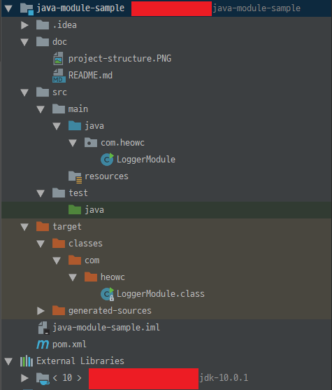
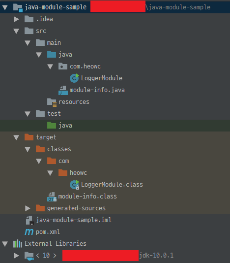

### Without Jigsaw



```bash
$ java -classpath ~/java-module-sample/target/classes com.heowc.LoggerModule
```

### With Jigsaw



```bash
$ java -p ~/java-module-sample/target/classes -m com.heowc/com.heowc.LoggerModule
```

- `-p`: `--module-path`
- `-m`: `--module`

